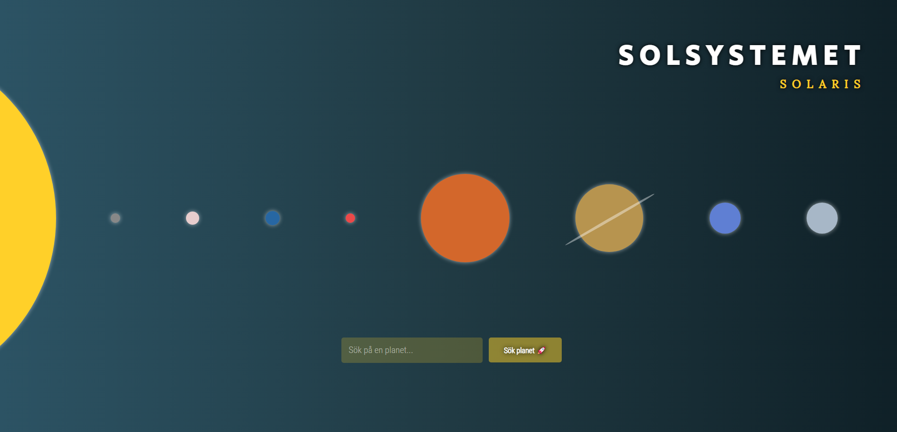

[Project URL](https://solaris-system.netlify.app)

# Solaris
En webbplats byggd med HTML, CSS & vanilla JS om vårt solsystem.

## UI
Förslag på UI hittar ni [här](https://www.figma.com/file/Snw8n1gba7Mbk6TCLEAB1A/JS-%2F-Solaris?node-id=0%3A1).

## Godkänt:
* Använt HTML, CSS (inkl. flexbox eller grid) och Vanilla JS 
* Kan söka på planeter med hjälp av textsök
* Visa sökresultat på ett snyggt sätt (Kan presentera vald planet på ett snyggt vis (ex. lightbox))

## Väl godkänt:
* Effekter på planeter mha CSS och JS. Ex: rotation vid hover, fina slides vid inladdning av planet
* Pagination-funktionalitet. Kunna bläddra mellan olika sidor av sökresultaten
* Felhantering där felkod presenteras användaren
